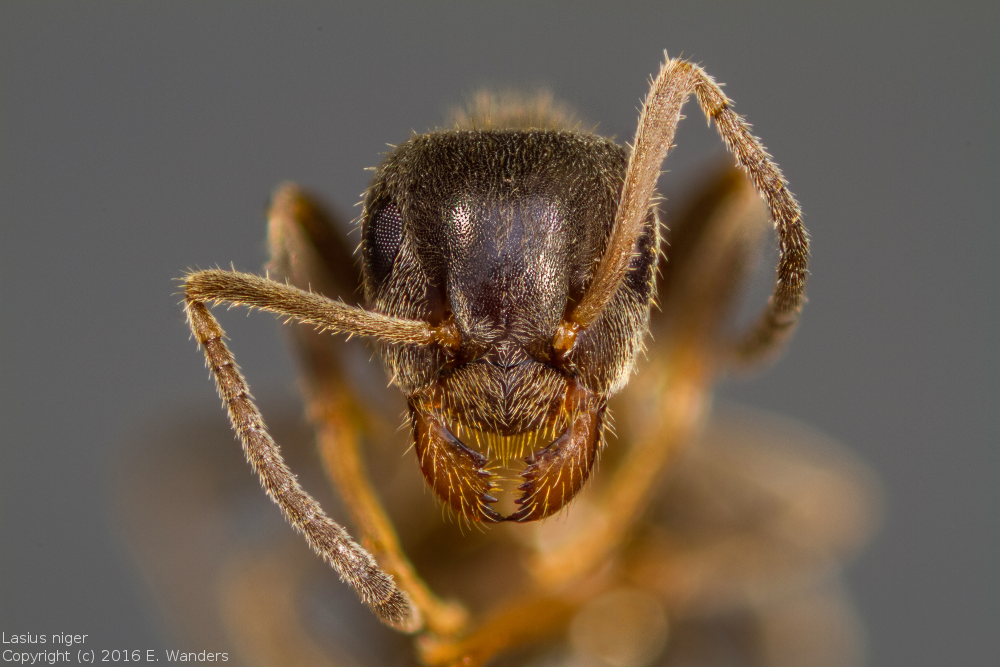

# Focus_stacking

[Focus Stacking][focusstacking] is a technique to combine several photographs
into a composite with a greater depth of field than the individual photographs.
This is often useful in macro photography, as there is a very shallow depth of
field in these images, this is also the intended use case for this project.

The individual photographs are made by taking a photograph and then moving the
camera closer to the object and taking another picture. Many steps might be
necessary to achieve high quality composite; automation of this is desirable.

This repository contains the software and documentation for a do-it-yourself
focus stacking rig. This project was originally started a few years ago and
although considered a great success, it was time for a rewrite to increase the
ease of use and the software portability. I decided to open-source this second
version in this repository.

The system is composed of the following: a linear guide from a microscope
is positioned horizontally, the camera sits on the carriage. A stepper motor is
used to rotate the knob used to move the carriage. The stepper motor and camera
are controlled by a microcontroller, which in turn is connected to a PC to
control it.

## Software
A webinterface is chosen as the way to present the user with a graphical user
interface. A webinterface is chosen over a native application because of the
increased portability. Python is used to provide a bridge between the
webinterface and the serial port used to communicate to the microcontroller.

### Firmware
The microcontroller used is a [Teensy LC][teensyLC], in the past an Arduino Uno
was used. However, using a more capable microcontroller with native USB support
allows for a greatly improved user experience. Additionally, having ample
resources available ensures that the functionality of the system is not limited
by hardware constraints.

A [custom class](firmware/motor_stepper.h) was written to perform non-blocking
stepper motor movement. It differs from other libraries in that it can ramp up
and down the velocity at the begin and end of the motion and guarantees that the
desired number of steps is made before the motion is complete (also, it does
this without floating point calculations).

For the two main components, the motor and the camera, abstract base classes are
created. The [StackControl](firmware/stack_control.h) class performs all the
interaction with those objects and is controlled through the
[StackInterface](firmware/stack_interface.h). Both the StackControl and
StackInterface class have a `run` method that is called continously and is
nonblocking.

The StackControl uses a state machine to control all operations:

This state machine is _always_ used when an action is performed, also when the
action is just taking a photograph or moving the motor without taking a sequence
of photographs. In this case of a motor move or a single photograph we enter the
pause state after the action is performed. The green arrows indicate a lambda
transition; the 'start' states are only there to initiate an action, after which
we continuously check whether the action is finished or still ongoing.

The StackInterface class is used to interface with microcontroller; it
listens to the serial port for instructions. These instructions allow it to set
the configurations of the motor, camera and stacking parameters. Additionally,
it can report its status at regular intervals and allows retrieval of the
current configuration. It also allows for starting the stack process with a
push button and operating the motor and camera without performing a stack
sequence.

The steppermotor class optionally depends on the [IntervalTimer][intervaltimer]
library for Teensy, this library allows calling a function at specific time
intervals. Although tests showed that this was not really required it does
ensure smooth movement of the motor. The [ElapsedMillis][ElapsedMillis] library
is also used extensively throughout the firmware.

### Graphical user interface

At the PC side of the serial port there is also a
[StackInterface](client/interface.py), but this time it is a Python class.
This class maintains two queue's, one for rx and one for tx. It uses a thread to
write messages to the serial port from a queue and puts messages that are
received on another queue. Methods are provided to place messages into the queue
for transmission or retreive a received message from the queue.

The messages themselves are [defined](client/message.py) using [ctypes][ctypes]
Structures, these direcly mirror those defined in the header files of the
firmware.

A [CherryPy][cherrypy] webserver is used to host the website and provide a
websocket for communication. The websocket mainly acts as a passthrough,
performing only the necessary type conversion before passing a message along to
the StackInterface.

The website uses [Bootstrap][bootstrap] for the visual representation, when a
configuration parameter is changed, it is automatically sent to the firmware.
If the value of the ui box matches the value as is reported by the firmware
the box is colored green, if it does not match the color will be amber.

## Hardware & Schematic
The microcontroller used is a [Teensy LC][teensyLC], an
[EasyDriver][easydriver45] board is used to move the stepper motor. The
camera is controlled via the wired remote control port on the camera, making a
photograph with this port requires connecting two wires to focus, subsequently
connecting the third wire to the other two to make a photograph. This is done
using two optocouplers to provide optoisolation between the camera and the focus
stacking system.

The complete schematic:

The linear guide from the microscope has knob which requires 20 revolutions
per 1 millimeter of linear movement, the stepper motor is connected to this knob
via an additional 1:2 transmission with a timing belt. The stepper motor in the
system moves 1.8 degrees per step, very small movements can be accurately
made. A photograph of the hardware can be seen 
[here](doc/photo/hardware_setup.jpg).

## Sample result
If you have read everything so far, you probably don't need an example image to
have an idea of what the result looks like, but here is one nonetheless.

A photograph of the Black Garden Ant
([Lasius niger][Lasiusniger]) made with this setup, the head is less
than one millimiter in size. All rights reserved for this photograph.

## License

MIT License, see LICENSE.md.

Copyright (c) 2016 Ivor Wanders

[teensyLC]: https://www.pjrc.com/teensy/teensyLC.html
[ElapsedMillis]: http://playground.arduino.cc/Code/ElapsedMillis
[intervaltimer]: https://www.pjrc.com/teensy/td_timing_IntervalTimer.html
[focusstacking]: https://en.wikipedia.org/wiki/Focus_stacking
[cherrypy]: http://www.cherrypy.org/
[ctypes]: https://docs.python.org/3.5/library/ctypes.html
[bootstrap]: http://getbootstrap.com/
[easydriver45]: http://www.schmalzhaus.com/EasyDriver/
[Lasiusniger]: https://en.wikipedia.org/wiki/Lasius_niger